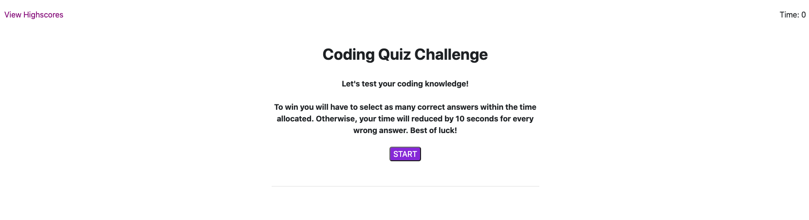

# Coding Quiz Challenge

# Table of Contents

* [Description](#description)
* [Instalation](#instalation)
* [Usage](#usage)
* [Tools](#tools)
* [Contact](#contact)
* [License](#license)
* [Acknowledgements](#acknowledgements)

## Description 
To complete a multiple-choice questions and interactive coding challenges that put your coding skills to the test. This applications is under time restrictions so the user needs to complete all questions within the time limit.

## Installation
For installation and deployment, please [click here](https://kimberly-rodriguez.github.io/web-api-code-quiz/). The GitHub link is [here](https://github.com/Kimberly-Rodriguez/web-api-code-quiz)

## Usage

The quiz performs the following tasks: 

 - The start button when click makes the timer starts and the first question is shown

 - The first question is answer and marked correct or incorrent then the next question follows

 - If answer is answer incorrectly time is subtracted from the timer

 - all questions are answered or the timer reaches 0 if not then the game is over

 - user can save their initials and my score once game is completed

 
 
 

## Tools

* This app will run in the browser and feature HTML and CSS powered by jQuery.

## Contact

If you have any question about my work or wish to collaborate in the future please contact me at: <krodriguez.ucla@gmail.com>

## License 

Licensed under the [MIT License](LICENSE).

## Acknowledgements
[UCLA Extension Coding Bootcamp](https://bootcamp.uclaextension.edu/coding/)

